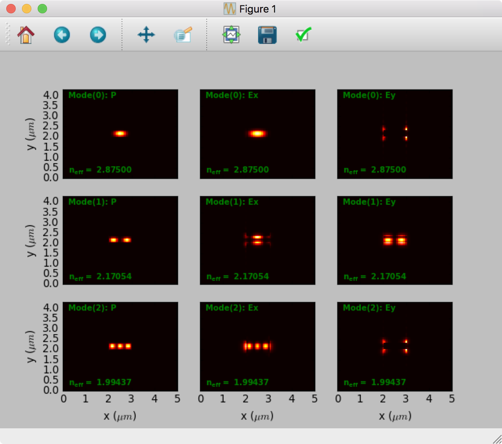

# CAMFR

Forked from [Sourceforge project](http://camfr.sourceforge.net/) for maintenance.

Originally written by [Peter Bienstman at Ghent University, Belgium](http://www.photonics.intec.ugent.be/contact/people.asp?ID=5).

## Introduction

CAMFR (CAvity Modelling FRamework) is a Python module providing a fast, flexible, full-vectorial Maxwell solver for electromagnetics simulations. Its main focus is on applications in the field of nanophotonics, like
- wavelength-scale microstructures (like photonic crystal devices, optical waveguides)
- lasers (like vertical-cavity surface-emitting lasers)
- light-emitting diodes (like resonant-cavity LEDs)

It is based on a combination of eigenmode expansion and advanced boundary conditions like perfectly matched layers (PML).  

Using an intuitive python scripting interface one can create and solve for the optical modes/fields in various wavelength-scale structures. Additional math and plotting can then be performed via the SciPy stack. The Eigenmode Expansion (EME) method is especially well-suited to solving for very thin layers, or structures in which the X and Y dimensions are very different, where typical methods like FDTD and FEM have trouble with the vastly differing X/Y discretization.

You can find more information, publications and details [here](http://www.photonics.intec.ugent.be/research/topics.asp?ID=17).

## Features

CAMFR was a research project, started at the photonics group of the Department of Information Technology (INTEC) at Ghent University in Belgium. CAMFR can be used to calculate
- the scattering matrix of a structure
- the field inside a structure, for any given excitation
- band diagrams of an infinite periodic structure
- threshold material gain and resonance wavelength of laser modes
- the response to a current source in an arbitrary cavity
- structures terminated by a semi-infinite repetition of another structure

This functionality is currently available for two types of geometries:
- 2D Cartesian structures
- 3D cylindrical symmetric structures

Additionally, there is code to model the extraction from light emitting diodes, either planar devices, or 3D devices which incorporate 2D periodic structures.

Defining structures is quite straightforward, either layer-by-layer, or using geometric primitive shapes. There are also integrated plotting routines for rapid simulation feedback.

One of the main benefits of the Eigenmode Expansion (EME) method is that very thin (nm) and thick (um) structures can be combined without incurring significant numerical errors, as is often the case for Finite-Difference meshing, in which large differences in the X/Y grids cause calculation problems. Also, once the modes/scattering matrices of a 1D slab or 2D Section have been calculated, extending those regions over an additional dimension does not require large amounts of computational power, as most of the work was in calculating the initial eigenmodes of the structure. This means that repeating structures can be simulated fairly quickly, since the eigenmodes are only calculated once for a repeating section.

## Framework/Module Character

CAMFR is utilized as a Python module, although internally it is conceived as a C++ framework, with all the algorithms implemented in terms of abstract waveguides and scatterers. This makes it extremely easy to extend CAMFR to new geometries.

The end user does not deal with this C++ code directly, but rather through bindings to the Python scripting language. This makes the code very clear and flexible, and allows e.g. to seamlessly integrate CAMFR with Python-aware visualistion tools such as [matplotlib](https://matplotlib.org) and [numpy](http://www.numpy.org).

## Examples
### Silicon Waveguide Mode Solver
Silicon waveguide, Power, Ex and Ey plotted with matplotlib:

See the file `examples/contrib/Example - Silicon-Waveguide ModeSim v2018-01.py` for a full working example.

### Brief Example
Example of rectangular waveguide construction syntax: We will create a rectangular waveguide of SiO2 cladding and Silicon core, calculate the first 4 modes mode & plot them.  

    >>> import camfr                # import the module

First, create some Materials with some refractive index:

    >>> SiO = camfr.Material( 1.45 )    # refractive index of SiO2
    >>> Si = camfr.Material( 3.4 )    # refractive index of Silicon

Then, create some 1-D slabs, by calling those Materials with a thickness value, and adding them together from bottom to top in a Slab:

    >>> clad = camfr.Slab(  SiO(15.75)  )      # Thicknesses in microns
    >>> core = camfr.Slab(  SiO(10.0) + Si(2.5) + SiO(5.0)  )
    
This created an imaginary "Slab" structure from bottom-to-top. For example `core` looks like:

            top         
    --------------------
            SiO
        5.0 um thick
    --------------------
            Si
       2.50 um thick
    --------------------
            SiO
       10.0 um thick
    --------------------
           bottom

Then make a 2-D structure by calling these Slabs with a width value, and adding them together from left to right in a Waveguide:

    >>> WG = camfr.Section(  clad(3.0) + core(1.0) + clad(4.0)  )   # Widths in microns
    
Which creates this imaginary 2-D Waveguide structure from left-to-right:

                                top         
    ---------------------------------------------------------
    |<----- 3.0um------>|<-----1.0um------>|<---- 4.0um---->|
    |                   |        SiO       |                |
    |                   |    5.0 um thick  |                |                
    |                   |------------------|                |
    |        SiO        |        SiN       |       SiO      |
    |      15.75um      |   2.50 um thick  |     15.75um    |
    |       thick       |------------------|      thick     |
    |                   |        SiO       |                |
    |                   |   10.0 um thick  |                |
    ---------------------------------------------------------
                               bottom

You can then have CAMFR calculate the modes as so:

    >>> WG.calc()

And plot the modes like so:

    >>> WG.plot()   # plots the fundamental mode with MatPlotLib.
    >>> fig = WG.plot(field=['P','Ex','Ey'], mode=[0,1,2])   # plots the Power and fields of 3 modes
    
See the Examples directory for full examples, as some details are missing here.

## Installation
CAMFR currently only supports Python 2.7.

To use CAMFR, download one of the released versions (see the "releases" or "tags" section of this github repo), or the bleeding-edge code, and extract the archive into a directory.  Follow the instruction in the `INSTALL` text file for your system.  You will have to compile the CAMFR library, as it compiles C code to generate the Python library.  A number of dependencies are required, which you can hopefully install easily through your system's package manager, or download directly from the developer websites.

The preferred method to run your scripts is through a Python IDE like Spyder (a matlab-like IDE).  The simplest installation of Spyder (along with all required scientific python modules) can be accomplished via [Python(x,y)](https://code.google.com/p/pythonxy/) (Win) or [Anaconda](http://continuum.io/downloads) (Mac,Win,Linux), or from source, for example via MacPorts `port install py27-spyder` on Mac OS. 

CAMFR scripts can also be run like any typical Python script on the command line via `python myScript.py` or `python -i myScript.py` to make it interactive afterwards.

## License and support

All the code is released under the GPL.
